[](https://travis-ci.org/IBM/watson-conversation-slots-intro)

# Watson Assistant のスロット機能を使用してピザ注文チャットボットを作成する

*他の言語で読む: [English](README.md), [한국어](README-ko.md)*

> Watson Conversation は現在、Watson Assistant です。このコードパターンの一部のイメージでは、サービスが Watson Conversation として表示されることがありますが、手順とプロセスは引き続き機能します。

このコードパターンでは、Watson Assistant スロット機能を使用して、ピザの注文を受け付けるチャットボットを作成します。サイズ、タイプ、トッピングの選択などの必要な情報は、以前のバージョンのアシスタントとは異なり、1つのアシスタントノード内に入力することができます。

このコード・パターンをひととおり完了すると、以下のスキルを身に付けることができます:

* Node.js と Watson Assistant を利用して単純なチャットボットを作成する
* Watson Assistant スロットを使用して、必要なデータを入力する
* スロットのハンドラーを使用して、スロットに当てはまらない会話のフローを処理する

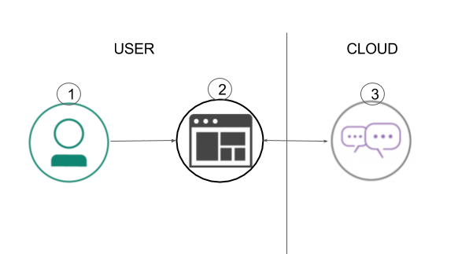

## Flow

1. ユーザーが、ローカルまたはIBM Cloud上で実行されている Node.js アプリケーションに対話を送信します。
2. アプリケーションは IBM Watson Assistant サービスにユーザー・メッセージを送信し、進行中のチャットを Web ページに表示します。
3. Watson Assistantは、スロット機能を使用してピザの注文に必要なフィールドをすべて用意し、返答がアプリケーションを介してユーザーに返されます。

## 含まれるコンポーネント

* [IBM Watson Assistant](https://www.ibm.com/watson/jp-ja/developercloud/conversation.html): 自然言語で対話可能なアプリケーションを、シンプルな開発ツールで迅速に構築します。

## 注目のテクノロジー

* [Node.js](https://nodejs.org/): スケーラブルなアプリケーションを構築するために設計された、非同期のイベント駆動型 JavaScript ランタイムです。

# ビデオを見る

#### Running this application with Cloud Foundry on IBM Cloud

[](https://youtu.be/6QlAnqSiWvo)

#### Running this application in a container with Kubernetes on IBM Cloud

[](https://youtu.be/G-rESweRG84)

# 手順

## IBM Cloud へのデプロイ

[](https://bluemix.net/deploy?repository=https://github.com/IBM/watson-conversation-slots-intro)

``Deploy to IBM Cloud`` ボタンをクリックして、``Create`` を実行して [ステップ5](#5-run-the-application) にジャンプ。

**もしくは**

## Run in container

[こちらの手順](doc/source/Container.md) に従い、IBM Cloud 上のコンテナで実行。

**もしくは**

## ローカル環境で実行
ステップ1-5を実行:

1. [リポジトリをクローンする](#1-clone-the-repo)
2. [IBM Cloud サービスを作成する](#2-create-ibm-cloud-services)
3. [IBM Cloud サービスの資格情報を入手し、.env ファイルに記載する](#3-get-ibm-cloud-services-credentials-and-add-to-env-file)
4. [Watson Assistant を構成する](#4-configure-watson-conversation)
5. [アプリケーションの実行](#5-run-the-application)

<a name="1-clone-the-repo"></a>
### 1. リポジトリをクローンする

`watson-conversation-slots-intro` リポジトリをローカル環境にクローンします。ターミナルで以下を実行:

```
$ git clone https://github.com/ibm/watson-conversation-slots-intro
```

Assistant インテント、エンティティ、ダイアログ ノードをアップロードするには、[`data/watson-pizzeria.json`](data/watson-pizzeria.json) ファイルを使用します。

<a name="2-create-ibm-cloud-services"></a>
### 2. IBM Cloud サービスを作成する

以下のサービスを作成し、`wcsi-conversation-service` という名前にします:

  * [**Watson Assistant**](https://console.ng.bluemix.net/catalog/services/conversation)

<a name="3-get-ibm-cloud-services-credentials-and-add-to-env-file"></a>
### 3. IBM Cloud サービスの資格情報を入手し、.env ファイルに記載する

IBM Cloud サービスを作成する際には、サービス資格情報を作成する必要があります。使用しているリージョンに基づいて、IAM (Identity Access and Management) またはユーザー名/パスワードベースの資格情報を取得できます。

最初に、`watson-conversation-slots-intro/env.sample` ファイルを ``watson-conversation-slots-intro/.env`` ファイルにリネームします。

* IBM Watson Assistant のサービス資格情報が以下のようにユーザー名/パスワードに基づいている場合は、ユーザー名、パスワード、および workspace_id を入力し、IAM 資格情報部分をコメントアウトします。
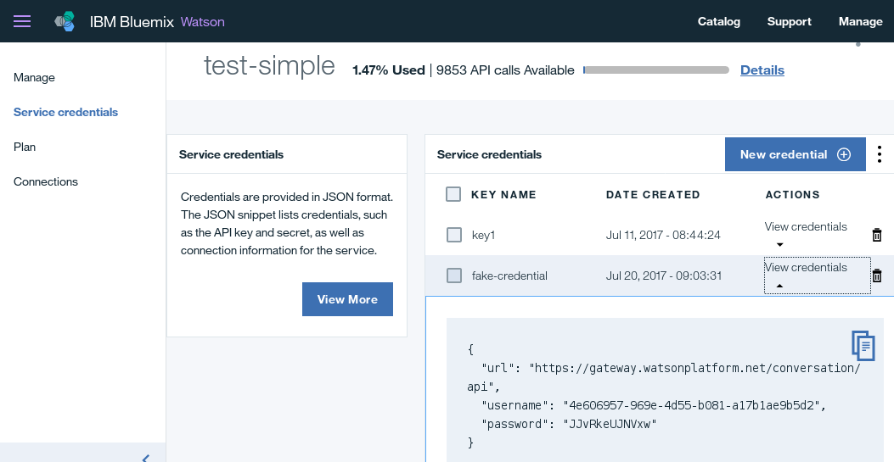

```
WORKSPACE_ID=<put workspace id here>

# Watson Assistant authentication using username/password authentication
CONVERSATION_USERNAME=<put assistant username here>
CONVERSATION_PASSWORD=<put assistant password here>

# Watson Assistant Authentication using IAM
#CONVERSATION_IAM_APIKEY=<put assistant IAM apikey here>
#CONVERSATION_URL=<put assistant url here>
```

* IBM Watson Assistant のサービス資格情報が以下のように IAM ベースである場合は、IAM apikey、url、workspace_idを入力し、ユーザー名/パスワードの部分をコメントアウトします。


```
WORKSPACE_ID=<put workspace id here>

# Watson Assistant authentication using username/password authentication
#CONVERSATION_USERNAME=<put assistant username here>
#CONVERSATION_PASSWORD=<put assistant password here>

# Watson Assistant Authentication using IAM
CONVERSATION_IAM_APIKEY=<put assistant IAM apikey here>
CONVERSATION_URL=<put assistant url here>
```


<a name="4-configure-watson-conversation"></a>
### 4. Watson Assistant を構成する

**Watson Assistant** ツールを起動します。右にある `import` アイコンボタンを使用します

<p align="center">
  
</p>

ローカルにクローンしたリポジトリから [`data/watson-pizzeria.json`](data/watson-pizzeria.json) ファイルを探し、`Import` を選択してください。新しいワークスペースのコンテキストメニューをクリックし、`View details` を選択して `Workspace ID` を探します。

<p align="center">
  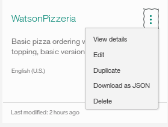
</p>

表示された `Workspace ID` の値を `.env` ファイルの `WORKSPACE_ID` 部分に記入してください。

<a name="5-run-the-application"></a>
### 5. アプリケーションの実行

#### Deploy to IBM Cloud ボタンを使用したのであれば...

もしあなたが ``Deploy to IBM Cloud`` を使用したのであれば、設定は自動で実施されています。

#### もしあなたがアプリをローカル環境で実行した場合は...

ターミナルで以下のコマンドを実行して依存するモジュールを導入し、アプリケーションの開始します:
```
$ npm install
$ npm start
```

# Assistant スロットに関する検討

スロットの使用することで、Watson Assistant ダイアログでロジックを実装するために必要なノードの数を削減することができます。 古いメソッドを使った部分的な会話ダイアログです:

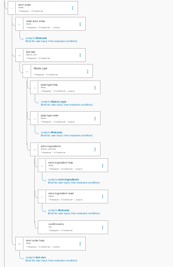

そして、ここには、上記のすべてのロジックを1つのノードで実現した、スロットを使用したより完全なダイアログがあります！


ダイアログを開くと、次のように表示されます:

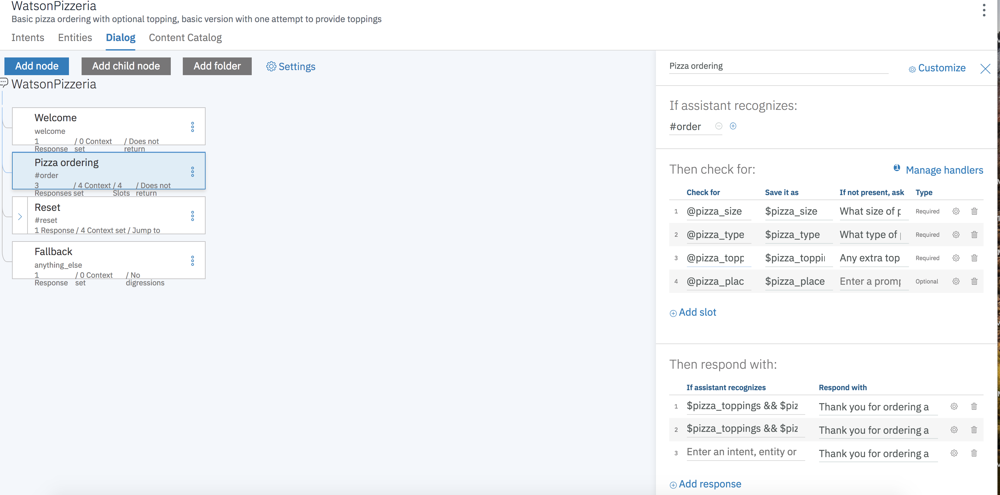

各スロットは、チャットボックスに入れるフィールドを表します: ``pizza_size``、``pizza_type``、``pizza_topings`` です。関連する変数 (``$ pizza_size``、``$ pizza_type``など) に対し、それらの値が設定されていない場合は、上から順に、すべてに値が入力されるまでプロンプトが表示され続けます。

設定  をクリックして、更に機能を追加してみましょう:

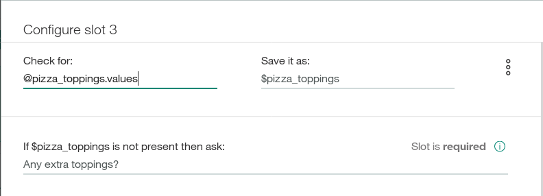

ここでは、このスロットが満たされたとき (Found) に、応答を追加できます。
ロジックは1つのトッピングに使用できます:

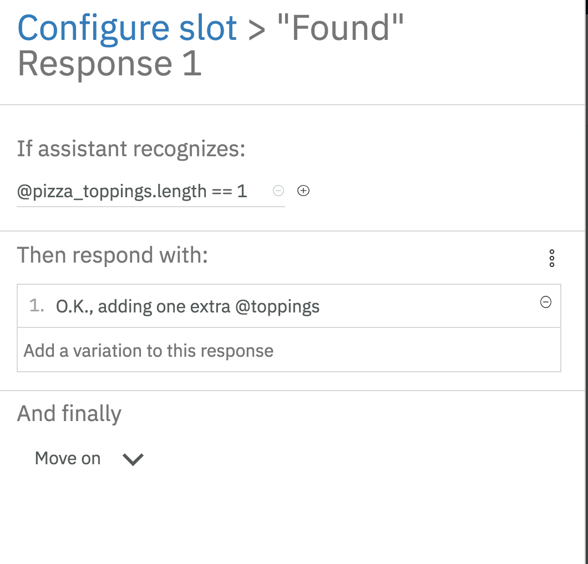

または2つ以上のトッピングが指定されている場合:

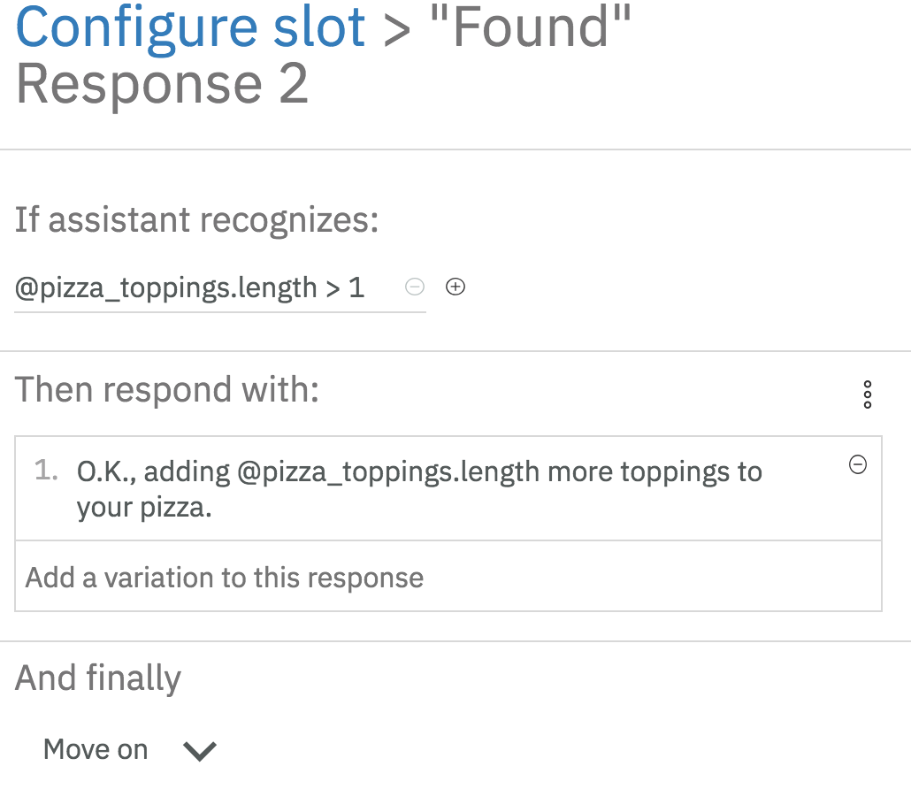

"Any extra toppings?" (トッピングを追加しますか？) という質問に "yes" または "no" と答えた場合のためのロジックを追加しました。

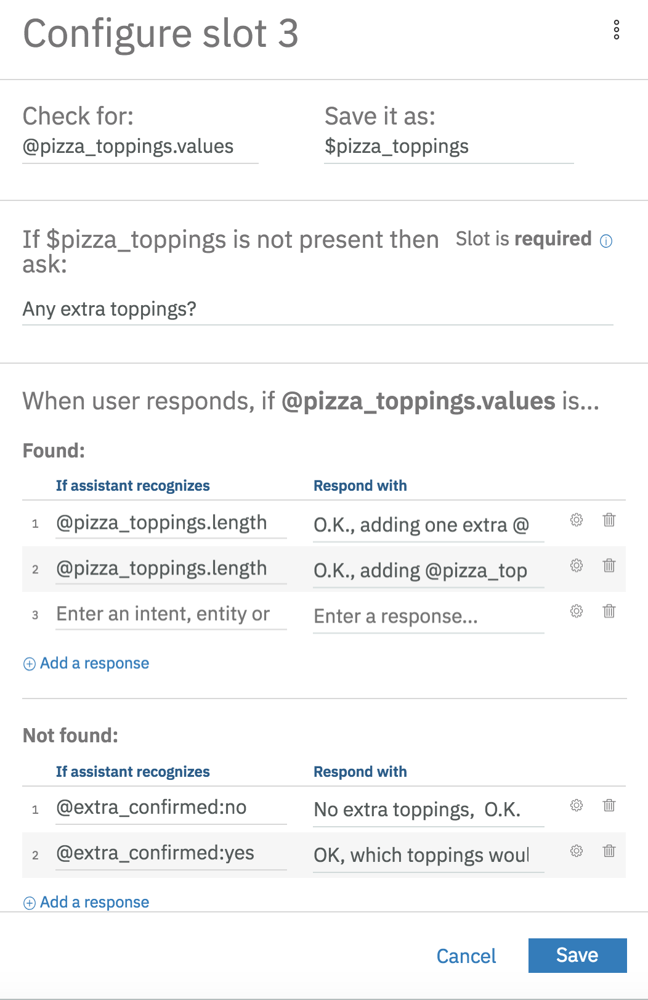

3点ドット  をクリックすると、json 形式でダイレクトに編集できます:

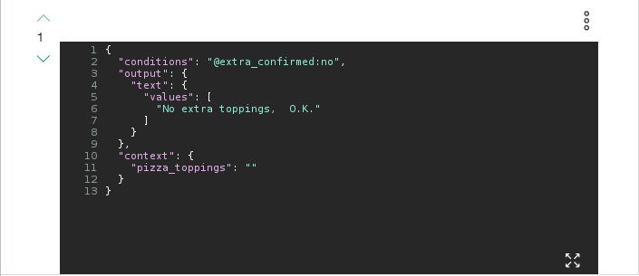

トッピングが不要ということですので、ここでは、コンテキストの {"pizza_topings"} フィールドに、空の値を設定しました。このスロットを埋めることでループを終了させることができます。

最後に、スロット全てがいっぱいになった時のための応答を追加します:

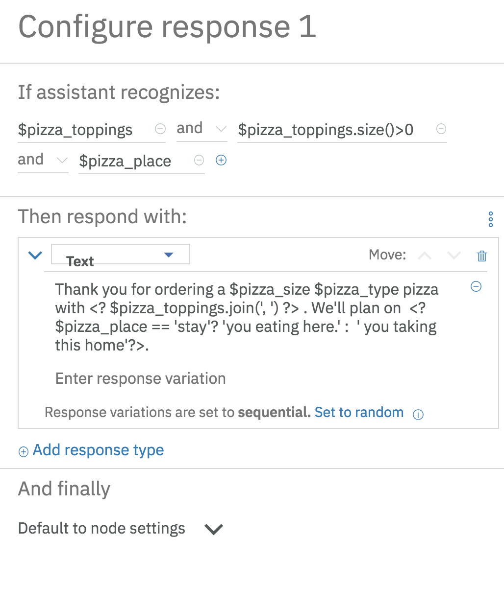

配列のサイズが0以上であること (size>0) を検出することによって、"pizza_topings" (トッピング) があるケースから始めます。ここでは、オプションの "pizza_place" スロットがいっぱいになった場合を最初に処理し、それから、そうでないケースを処理します。

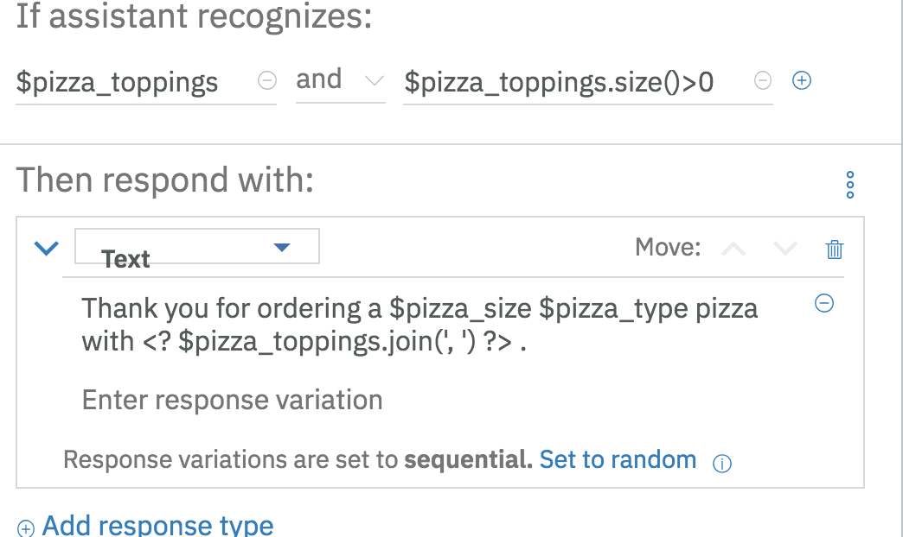

最後に、プロンプトに対するユーザーの回答が見つからない場合のハンドラを追加します。"help" と "reset" という意図のハンドラがあります。

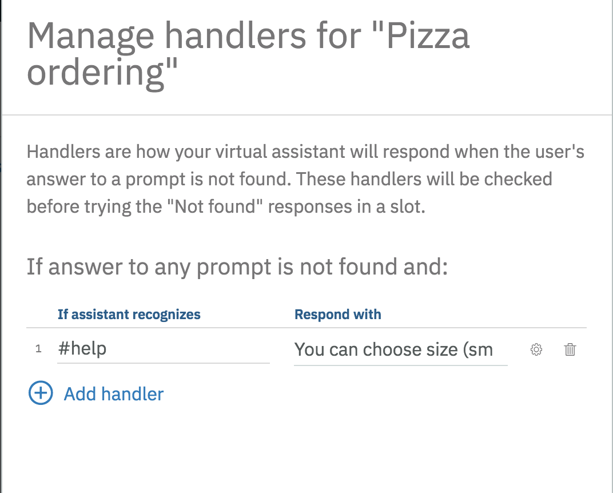

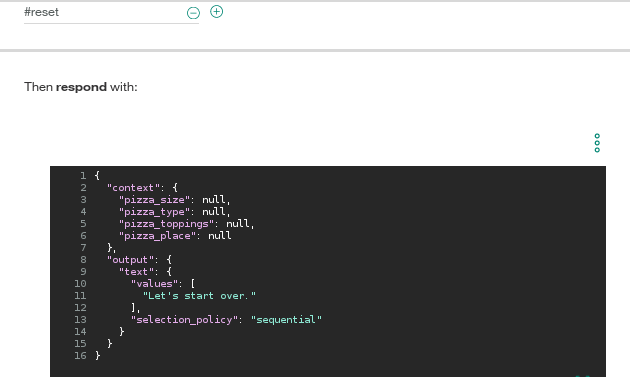

"reset" を処理するときに json を直接編集することに注意してください。この記述は、すべてのフィールドを null に設定して、処理を再開します。

# Assistant の例

今回のサンプルとの会話と、関連するjsonを見てみましょう。
あなたの Watson Pizzeria が動作している状態で、ダイアログを開始して、ピザボットに「大きなピザを欲しい」と言ってみましょう。

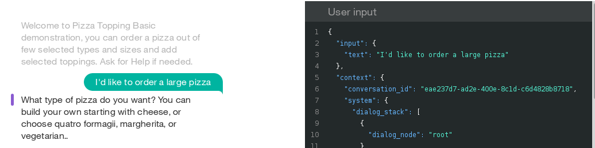

`User Input` はあなたの入力を示す "input"{"text"} フィールドと、主に Assistant が内部状態を維持し管理するための "context" フィールドを示しています。
下にスクロールして `Watson Understands` と `intents` を見てみましょう：

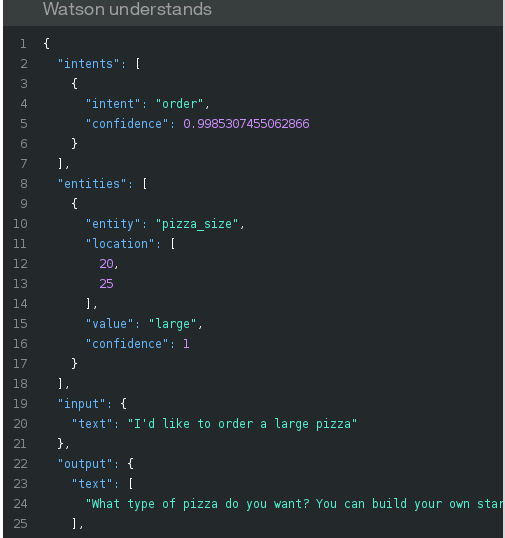

"order" のインテント (意図) が検出されることに注意してください。
エンティティ "pizza_size" は、(large という値が) 記入されたスロットになりました。
2つの必須スロット "pizza_type" と "pizza_toppings" がまだ残っています。
ユーザーが、全てのスロットの入力を完了するまで、プロンプトが表示され続けます:

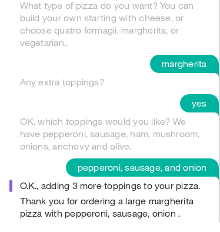

これで全ての必須スロットへの入力が実施されました:

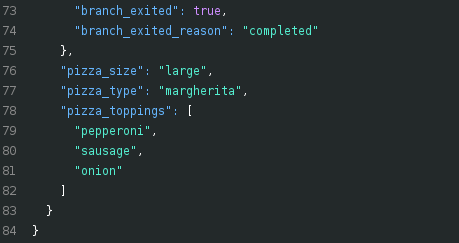

Watson Pizzeria に、「そのピザをレストランで食べたかった」と伝えたいのですが？
遅すぎます！
"pizza_place" のスロットはオプションなので、ユーザーにはそのプロンプトが表示されません。
必要なスロットがいっぱいになると、"Pizza Ordering" ダイアログ・ノードを終了します。

ユーザーはオプションのスロットに先に入力する必要があります。
"reset" をタイプしてもう一度開始し、"to eat there..." というフレーズを追加して会話をテストします:

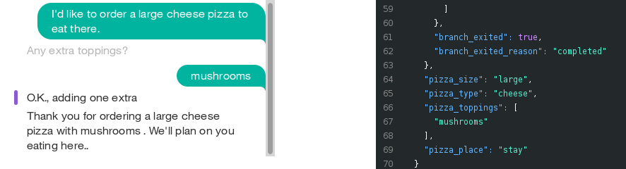

今度はちゃんと、このレストランでピザを食べられますね。

# Troubleshooting

* Cloud Foundry の `cf push` コマンドによるデプロイの際、以下のエラーが表示された場合:

``FAILED
Could not find service <Watson_service> to bind to <IBM_Cloud_application>``

あなたのサービスに `wcsi-conversation-service` という名前をつけたのなら、これはうまくいくはずです。
`cf push` を使うと、マニフェスト `manifest.yml` ファイルにリストされているサービスにバインドしようとします。

したがって、これを動作させるには2つの方法があります:

* マニフェスト内の名前と一致するように、IBM Cloud サービスの名前を変更します。
* マニフェスト内の名前を、IBM Cloudサービスの名前と一致するように変更します。

>ノート: `Deploy to IBM Cloud` ボタンは、その場の情報をもとに (正しい名前で) サービスを作成することで、この問題を解決します。

# ライセンス

[Apache 2.0](LICENSE)

# リンク

* [YouTube 上のデモ](https://youtu.be/6QlAnqSiWvo)
* [IBM Watson Assistant ドキュメント](https://console.bluemix.net/docs/services/conversation/dialog-build.html#dialog-build)
* [IBM Watson Assistant Slots コードパターンに関するブログ](https://developer.ibm.com/code/2017/09/19/managing-resources-efficiently-watson-conversation-slots/)

# もっと詳しく知る

* **Artificial Intelligence コードパターン**: このコードパターンを気に入りましたか？ [AI Code コードパターン](https://developer.ibm.com/jp/technologies/artificial-intelligence/) から関連パターンを参照してください。
* **AI and Data コードパターン・プレイリスト**: コードパターンに関係するビデオ全ての [プレイリスト](https://www.youtube.com/playlist?list=PLzUbsvIyrNfknNewObx5N7uGZ5FKH0Fde) です。
* **With Watson**: [With Watson プログラム](https://www.ibm.com/watson/jp-ja/with-watson/) は、自社のアプリケーションに Watson テクノロジーを有効的に組み込んでいる開発者や企業に、ブランディング、マーケティング、テクニカルに関するリソースを提供するプログラムです。
* **Kubernetes on IBM Cloud**: [IBM Cloud の Kubernetes と Docker](https://www.ibm.com/cloud-computing/bluemix/containers) の力を組み合わせてアプリを配信する。
