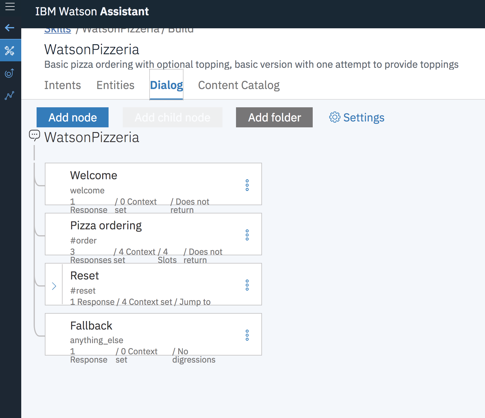
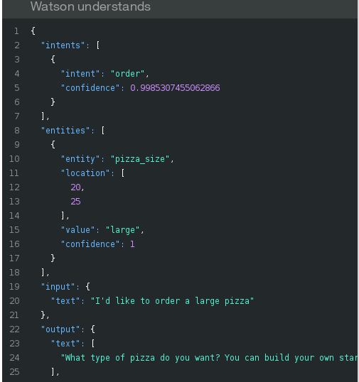

[](https://travis-ci.org/IBM/watson-conversation-slots-intro)

# Watson Assitant Slots 기능을 사용해 피자 주문용 챗봇 만들기

*다른 언어로 보기 : [English](README.md)*

> Watson Conversation이 Watson Assistant로 변경되었습니다. 이 코드 패턴에 있는 몇몇 이미지들은 이러한 변경 사항이 반영되기 전 버전인 Watson Conversation 서비스로 소개할 수 있지만, 과정상 동일하게 작동하오니 참고하시기 바랍니다.

이 코드 패턴에서 우리는 피자 주문용 챗봇을 만드는데 Watson Assitant Slots 기능을 사용합니다. 이전 버전과는 달리 피자 사이즈, 종류, 토핑 선택 등 모든 필요한 정보들을 한 개의 Assitant 노드에 입력할 수 있습니다.

이 코드 패턴을 진행하시면, 다음의 내용을 배울 수 있습니다.

* Watson Assitant로 챗봇 만들기
* Assistant Slots로 데이터 필드를 손쉽게 채우는 방법
* Assistant Slots로 한 개의 노드 내에서 다양한 입력을 처리하는 방법


## 아키텍처 흐름도

1. 사용자가 애플리케이션에 메시지를 전송합니다(로컬 또는 IBM Cloud에서 실행되는)
2. 애플리케이션은 사용자의 메시지를 IBM Watson Assistant에서 서비스로 전송하고, 진행중인 대화를 웹페이지에 표시합니다.
3. Watson Assistant가 Slots 기능을 사용해 피자 주문에 필요한 필드를 채우고, 실행 중인 애플리케이션에 추가 정보를 요청합니다.

## 구성 요소

* [IBM Watson Assistant](https://www.ibm.com/watson/developercloud/conversation.html): 모바일 디바이스, 메시징 플랫폼, 실제 로봇 등에 챗봇 또는 가상 에이전트를 구축, 테스트 및 배포할 수 있습니다.

## 주요 기술
* [Node.js](https://nodejs.org/): 확장 가능한 애플리케이션을 구축하도록 설계된 비동기 이벤트 기반 JavaScript런타임입니다.

# 데모 보기

#### IBM Cloud에서 Cloud Foundry로 애플리케이션 실행하기

[](https://youtu.be/6QlAnqSiWvo)

#### IBM Cloud의 Kubernetes 컨테이너에서 애플리케이션 실행하기

[](https://youtu.be/G-rESweRG84)

# 단계

## IBM Cloud에 배포하기

[](https://bluemix.net/deploy?repository=https://github.com/IBM/watson-conversation-slots-intro)

``Deploy to IBM Cloud``버튼을 클릭한 후, ``create``을 누르면 바로 5단계로 건너뛸 수 있습니다.

**또는**

## 컨테이너에서 실행하기

[이 설명서를](doc/source/Container.md) 읽고 IBM Cloud의 컨테이너에서 실행시킵니다.

 **또는**

## 로컬에서 실행하기
 1~5단계를 실행합니다:

1. [저장소 복제하기](#1-저장소-복제하기)
2. [IBM Cloud 서비스 생성하기](#2-ibm-cloud-서비스-생성하기)
3. [IBM Cloud 서비스 신임정보를 .env에 추가하기](#3-ibm-cloud-서비스-신임정보를-받아서-env-파일에-추가하기)
4. [Watson Assistant 구성하기](#4-watson-assistant-구성하기)
5. [애플리케이션 실행하기](#5-애플리케이션-실행하기)

### 1. 저장소 복제하기

`watson-conversation-slots-intro`를 로컬에 복제합니다. 터미널에서 다음을 실행합니다:

  `$ git clone https://github.com/ibm/watson-conversation-slots-intro`

Assistant Intents, Entities, Dialog 노드를 업로드하기 위해 [`data/watson-pizzeria.json`](data/watson-pizzeria.json) 파일을 사용하게 됩니다.

### 2. IBM Cloud 서비스 생성하기

아래 서비스를 생성하고 이름을 `wcsi-conversation-service`로 설정합니다 :

  * [**Watson Assistant**](https://console.ng.bluemix.net/catalog/services/conversation)

### 3. IBM Cloud 서비스 신임정보를 받아서 .env 파일에 추가하기

IBM Cloud 서비스를 생성할 때 서비스 신임정보를 생성해야 합니다. 설정하신 지역(region)에 따라 IAM(Identify and Access Management) 또는 username/password 기반 신임정보 받을 수 있습니다.

먼저 `watson-conversation-slots-intro/env.sample` 파일을 참고해 `watson-conversation-slots-intro/.env`를 생성합니다.

* IBM Watson Assistant의 서비스 신임정보가 아래와 같이 사용자 이름과 패스워드 기반이라면, username, password, WorkSpace_id를 입력하고 IAM 신임정보 부분을 주석처리 합니다.


``` 
WORKSPACE_ID=<put workspace id here>

# Watson Assistant authentication using username/password authentication
CONVERSATION_USERNAME=<put assistant username here>
CONVERSATION_PASSWORD=<put assistant password here>

# Watson Assistant Authentication using IAM
#CONVERSATION_IAM_APIKEY=<put assistant IAM apikey here>
#CONVERSATION_URL=<put assistant url here>
```
* IBM Watson Assistant의 서비스 신임정보가 아래와 같이 IAM 기반일 경우, IAM apikey, url, workspace_id를 입력하고 사용자 이름/패스워드 부분을 주석처리 합니다.

```
WORKSPACE_ID=<put workspace id here>

# Watson Assistant authentication using username/password authentication
#CONVERSATION_USERNAME=<put assistant username here>
#CONVERSATION_PASSWORD=<put assistant password here>

# Watson Assistant Authentication using IAM
CONVERSATION_IAM_APIKEY=<put assistant IAM apikey here>
CONVERSATION_URL=<put assistant url here>
```

### 4. Watson Assistant 구성하기

**Watson Assistant** 툴을 시작합니다. 오른쪽의 `가져오기` 아이콘을 누릅니다.

<p align="center">
  
</p>

[`data/watson-pizzeria.json`](data/watson-pizzeria.json)의 로컬버전을 찾아 `가져오기`를 클릭합니다. 새 워크스페이스의 콘텍스트 메뉴를 클릭하여 `Workspace_ID`를 찾아 `View details`를 누릅니다.

<p align="center">
  
</p>

이 `Workspace ID`를 `.env` file에 `WORKSPACE_ID`로 넣습니다.

### 5. 애플리케이션 실행하기

#### Deploy to IBM Cloud를 사용한 경우

``Deploy to IBM Cloud``를 사용한 경우, 자동으로 설치됩니다.

#### 로컬에서 앱을 실행한 경우

```
$ npm install
$ npm start
```

# Assistant Slots 디스커션

Slots의 장점은 Watson Assistant Dialog에서 논리를 구현하는데 필요한 노드 수를 줄인다는 것에 있습니다. 다음은 이전의 방법을 사용한 대화입니다:


그리고 아래는 Slots를 사용한 대화입니다. 모든 논리가 하나의 노드에 배치되지요!



대화상자를 열면 다음을 확인할 수 있습니다:


각 slot은 ``pizza_size``, ``pizza_type``, ``pizza_topings``등 챗봇에 넣어야할 필드를 나타냅니다. 필드가 표시되지 않으면 모든 연관변수(``$pizza_size``, ``$pizza_type`` 등)가 입력될 때까지 사용자는 다시 위에서부터 시작하게 됩니다.


기능을 추가하려면 구성 아이콘  을 클릭합니다.


이 slot이 채워지면 response를 추가할 수 있습니다. 로직은 토핑이 하나 추가될 때 사용됩니다.


또는 토핑이 하나 이상 추가된 경우 :


"토핑을 더 추가하시겠습니까?"라는 질문에 대한 예/아니오 대답을 제출하기위해 로직을 하나 더 추가합니다:


json을 바로 편집하기위해 동그라미 3개  아이콘을 클릭합니다:


여기서 이 slot을 채우면 루프를 끝내도록 Context {"pizza_topings"}필드에 빈 값을 설정했습니다.

마지막으로 slot이 모두 채워지면 response를 추가합니다.


먼저 어레이가 size>0임을 감지하고 "pizza_topings"가 있는 경우를 살펴보겠습니다. 여기서는 먼저 선택사항인 "pizza_place"slot이 채워진 경우를 처리한 후, 그렇지 않은 경우를 처리합니다.


마지막으로 사용자가 프롬프트에 응답하지 않는 경우 핸들러를 추가합니다. "help"와 "reset"인텐트를 다루고 있습니다.


reset을 처리할 때 json을 직접 편집합니다. 다시 시작하려면 모든 필드를 null로 설정합니다.

# Assistant 예제

이제 대화 예제와 이에 연관된 json을 살펴보겠습니다. 'Watson Pizzaria'가 실행되고 있는 상태에서 대화를 시작합니다. 챗봇에게 라지사이즈 피자를 주문하겠다고 말해봅니다:


'User Input'은 "input"{"text"} 필드를 표시할 뿐만 아니라 내부 상태를 트래킹하는데 주로 사용되는 "context"필드도 표시합니다. `Watson Understands`를 찾아 화면을 스크롤하셔서 `intents`를 찾아보세요 :



"주문"에 대한 인텐트가 감지되었습니다. "pizza_size" 엔티티가 슬롯에 채워졌습니다.
아직 "pizza_type"와 "pizza_toppings" slot이 남아있어 사용자에게 항목을 입력하라는 메시지가 뜨게 됩니다.


이제 모든 slot이 채워졌습니다.


만약 고객이 'Watson Pizzaria' 가게에서 피자를 먹고싶다고 말한다면 어떻게 될까요? "pizza_place"는 선택사항이라서 사용자에게 메시지가 표시되지 않고, 필수 slot이 채워지면 "피자 주문" 대화상자 노드를 종료하게 됩니다. 사용자는 먼저 선택사항인 slot을 채워야 합니다. reset을 입력해 다시 시작하고 "to eat there..."문구를 추가한 후 테스트합니다.


# 문제 해결

* 클라우드 파운드리 `cf push`를 이용한 배포는 :

``FAILED
Could not find service <Watson_service> to bind to <IBM_Cloud_application>``

만약 서비스 이름이 `wcsi-conversation-service`라면 실행됩니다.
만약 `cf push`를 이용한다면 `manifest.yml`목록에 있는 서비스를 bind하려 할 것입니다.

이 작업을 수행하는 방법은 두 가지가 있습니다:

* manifest에 있는 이름과 일치하도록 IBM Cloud 서비스의 이름을 변경
* IBM Cloud 서비스의 이름과 일치하도록 manifest의 이름을 변경

>NOTE: `Deploy to IBM Cloud` 버튼은 서비스를 올바른 이름으로 즉시 생성해 이 문제를 해결합니다.

# 라이센스

[Apache 2.0](LICENSE)

# 관련 링크

* [유튜브 데모보기](https://youtu.be/6QlAnqSiWvo)
* [IBM Watson Assistant Docs](https://console.bluemix.net/docs/services/conversation/dialog-build.html#dialog-build)
* [IBM Watson Assistant Slots 관련한 코드 패턴 블로그](https://developer.ibm.com/code/2017/09/19/managing-resources-efficiently-watson-conversation-slots/)

# 더 알아보기

* **AI 코드 패턴**: 이 코드 패턴이 도움이 되셨나요? 다른 [AI 코드패턴](https://developer.ibm.com/code/technologies/artificial-intelligence/)도 확인해보세요.
* **AI 및 데이터 코드패턴 Playlist**: 다른 코드 패턴 영상과 함께 [플레이리스트](https://www.youtube.com/playlist?list=PLzUbsvIyrNfknNewObx5N7uGZ5FKH0Fde)를 즐겨찾기하세요.
* **With Watson**: Watson에 대해 더 알아보고 싶다면? [Join the With Watson program](https://www.ibm.com/watson/with-watson/)에서 리소스를 확인해보세요.
* **Kubernetes on IBM Cloud**: [Kubernetes and Docker on IBM Cloud](https://www.ibm.com/cloud-computing/bluemix/containers)도 이용해보세요.
