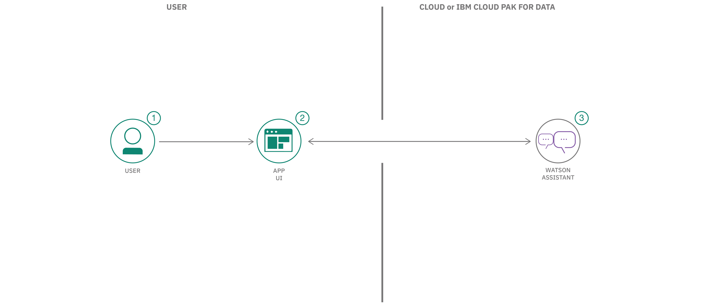
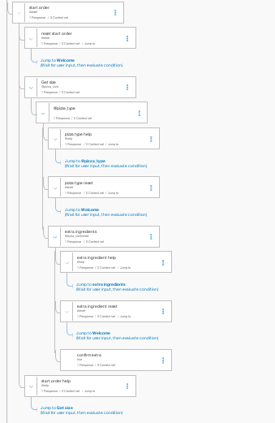
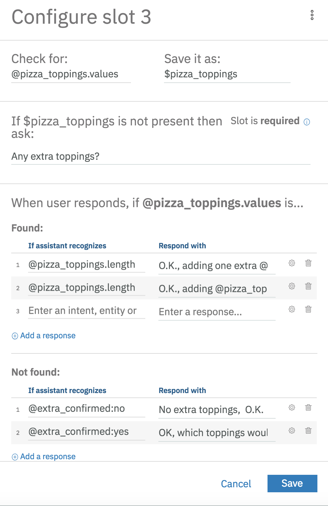
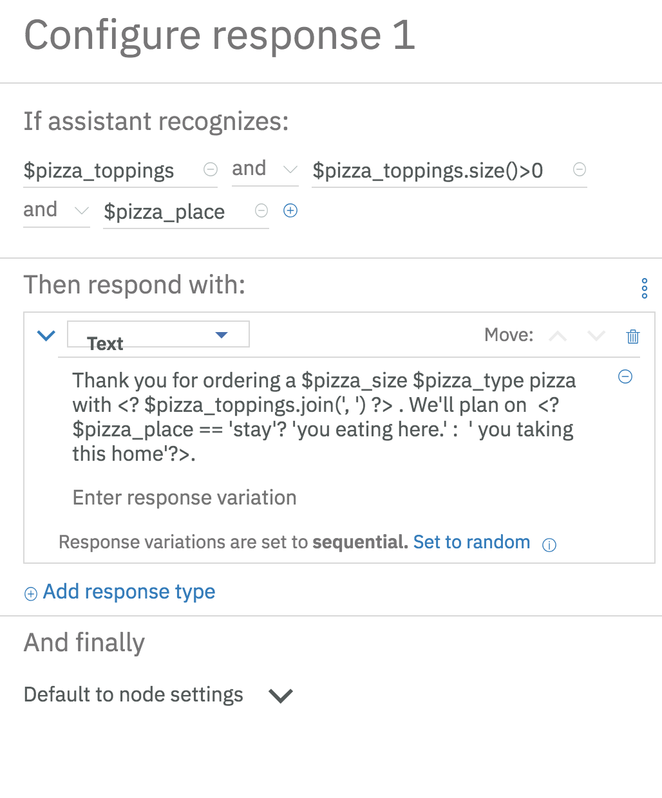
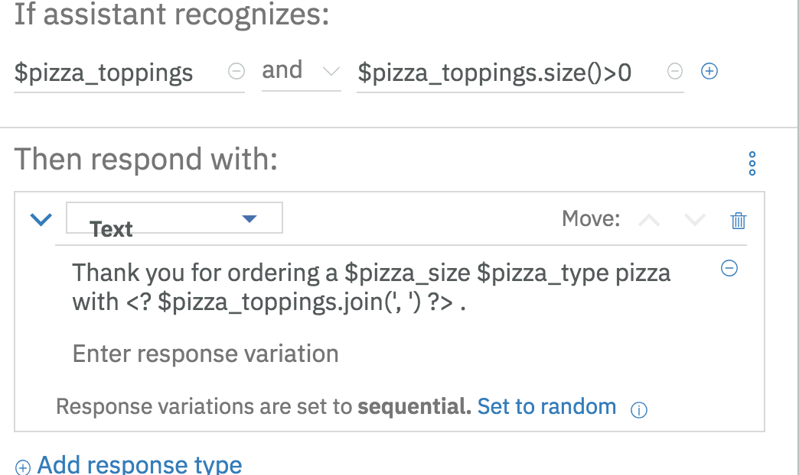

# Creating a pizza ordering chatbot using Watson Assistant slots feature

In this Code Pattern, we will use the Watson Assistant Slots feature to build a chatbot that takes a pizza order. The needed information such as size, type, and ingredient choices can all be entered within one Assistant Node, unlike with previous versions of Assistant.

When the reader has completed this Code Pattern, they will understand how to:

* Create a chatbot dialog with Watson Assistant
* Use the power of Assistant Slots to more efficiently populate data fields
* Use Assistant Slots to handle various inputs within one Node.

## Flow

1. User sends messages to the application (running locally or on IBM Cloud).
2. The application sends the user message to IBM Watson Assistant service, and displays the ongoing chat in a web page.
3. Watson Assistant uses the Slots feature to fill out the required fields for a pizza order, and sends requests for additional information back to the running application.

## Included Components

* [IBM Watson Assistant](https://www.ibm.com/cloud/watson-assistant/): Build, test and deploy a bot or virtual agent across mobile devices, messaging platforms, or even on a physical robot.

## Featured technologies

* [Node.js](https://nodejs.org/): An asynchronous event driven JavaScript runtime, designed to build scalable applications.

## Watch the Video

| Using Cloud Foundry on IBM Cloud | Using IBM Cloud's Kubernetes service |
| - | - |
|  |  |

## Deployment options

Click on one of the options below for instructions on deploying the app.

|   |   |   |   |
| - | - | - | - |
|  |  |  |  |

## Assistant Slots Discussion

The power of Slots is in how it reduces the number of nodes required to implement logic in your Watson Assistant Dialog. Here's a partial conversation Dialog using the old method:

And here's a more complete Dialog using slots, which puts all the logic in the `Pizza ordering` Node.

Open up the Dialog, and we'll have a look:

Each slot represents a field to be populated in the chatbot: ``pizza_size``, ``pizza_type``, and ``pizza_topings``.
If they are not present, the user will be prompted, starting at the top, until all are populated via
the associated variable (``$pizza_size``, ``$pizza_type``, etc).

Click on the Configure  to add more functionality:

Here, we can add a response for when this slot is filled (Found).
Logic can be used for one ingredient:

or if there are greater than one ingredient added:

We've added logic to address yes or no answers to the question "Any extra toppings?":

Click on the 3 circles  and choose `Open JSON editor` to edit the json directly:

Here, we've set an empty value for the context: {"pizza_topings"} field, so that we can exit
the loop by filling this slot.

Finally, we add responses for once the slots are all filled:

We start with the case where we have "pizza_toppings", by detecting that the
array has size>0.
Here, we first handle the case where the optional "pizza_place" slot
is filled, and then handle the case where it is not.

Finally, we add a handler for the case where the user's answers to a prompt
is not found. We've added a handler for the intent "help".

We have a dialog node to handle the intent `#reset` which will reset all fields to `null`:

## Assistant Example

Let's look at an example conversation and the associated json.
With your Watson Pizzeria running, start a dialog and begin with
telling the Pizza Bot you want a large pizza:

The 'User Input' shows you the "input"{"text"} field, as well as come of the
"context" that is mostly used for Assistant to keep track of internal state.
Scroll Down to `Watson Understands` and look at `intents`:

Note that the intent for "order" is detected. The entity "pizza_size" is now
a slot that is filled out.
We still have 2 required slots, "pizza_type" and "pizza_toppings". The user will
be prompted until these are filled out:

We can now see that all required slots are filled:

What if we wanted to tell the Watson Pizzeria that we wanted to
eat the pizza there, in the restaurant? Too late! the slot for
"pizza_place" is optional, so the user won't be prompted for it, and
once the required slots are filled, we exit the "Pizza Ordering" dialog
node. The user needs to fill out optional slots first.
Type reset to start again and test this by adding the phrase "to eat there...":

## Troubleshooting

* Deploy using Cloud Foundry `cf push` gives:

``FAILED
Could not find service <Watson_service> to bind to <IBM_Cloud_application>``

If you name your service `wcsi-conversation-service`, this should work.
When you use `cf push`, it is trying to bind to the services listed in the `manifest.yml`.

So, there are 2 ways you can get this to work:

* Change the names of your IBM Cloud services to match the names in the manifest.
* Change the names in the manifest to match the names of your IBM Cloud services.

>NOTE: The `Deploy to IBM Cloud` button solves this issue by creating the services on the fly (with the correct names).

## License

This code pattern is licensed under the Apache Software License, Version 2.  Separate third party code objects invoked within this code pattern are licensed by their respective providers pursuant to their own separate licenses. Contributions are subject to the [Developer Certificate of Origin, Version 1.1 (DCO)](https://developercertificate.org/) and the [Apache Software License, Version 2](https://www.apache.org/licenses/LICENSE-2.0.txt).

[Apache Software License (ASL) FAQ](https://www.apache.org/foundation/license-faq.html#WhatDoesItMEAN)

## Links

* [Demo on youtube](https://youtu.be/6QlAnqSiWvo)
* [IBM Watson Assistant Docs](https://cloud.ibm.com/docs/services/conversation/dialog-build.html#dialog-build)
* [Blog for IBM Watson Assistant Slots Code Pattern](https://developer.ibm.com/code/2017/09/19/managing-resources-efficiently-watson-conversation-slots/)

## Learn more

* **Artificial Intelligence Code Patterns**: Enjoyed this Code Pattern? Check out our other [AI Code Patterns](https://developer.ibm.com/technologies/artificial-intelligence/).
* **AI and Data Code Pattern Playlist**: Bookmark our [playlist](https://www.youtube.com/playlist?list=PLzUbsvIyrNfknNewObx5N7uGZ5FKH0Fde) with all of our Code Pattern videos
* **With Watson**: Want to take your Watson app to the next level? Looking to utilize Watson Brand assets? [Join the With Watson program](https://www.ibm.com/watson/with-watson/) to leverage exclusive brand, marketing, and tech resources to amplify and accelerate your Watson embedded commercial solution.
* **Kubernetes on IBM Cloud**: Deliver your apps with the combined the power of [Kubernetes and Docker on IBM Cloud](https://www.ibm.com/cloud/container-service)
