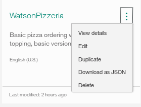

# Running watson-conversation-slots-intro in a Container on IBM Cloud with Kubernetes

This directory allows you to deploy the `watson-conversation-slots-intro` application into a container running on IBM Cloud, using Kubernetes.

The commands below use environment variables in order to define the specific details of the deployment. Either run the following to export the ENV variables, or substitute your names in the commands or exports:
```bash
export CLUSTER_NAME=Watson
export CONVERSATION_SERVICE=conversation-service-watson-pizzeria
export CONFIG_MAP=watson-pizzeria-config
export POD_NAME=watson-pizzeria-pod.yml
export KUBE_SERVICE=pizza-bot
export CONTAINER_ENV_VARIABLE=service_watson_conversation
```

# Steps

## Create the Kubernetes cluster

* Follow the instructions to [Create a Kubernetes Cluster](https://github.com/IBM/container-journey-template). If you already have a cluster, or choose a cluster name other than the one exported as $CLUSTER_NAME, re-export this new name:

```bash
export CLUSTER_NAME=<your_cluster_name>
```

* Set the Kubernetes environment to work with your cluster:

```bash
ibmcloud cs cluster-config $CLUSTER_NAME
```

The output of this command will contain a KUBECONFIG environment variable that must be exported in order to set the context. Copy and paste the output in the terminal window. An example is:

```bash
export KUBECONFIG=/home/rak/.bluemix/plugins/container-service/clusters/Kate/kube-config-prod-dal10-<cluster_name>.yml
```

## Create the Watson Conversation Service and bind to your cluster

Either follow the instructions to [Create a Conversation Service](https://console.ng.bluemix.net/catalog/services/conversation) or perform the following from the CLI.

* Create the Watson Conversation service:

```bash
ibmcloud service create conversation free $CONVERSATION_SERVICE
```

* Verify that the service instance is created:

```bash
ibmcloud service list
```

* Obtain the ID of your cluster:

```bash
ibmcloud cs clusters
```

* Bind the service instance to your cluster:

```bash
ibmcloud cs cluster-service-bind <cluster-ID> default $CONVERSATION_SERVICE
```

## Load the Watson Conversation

* Launch the [**Watson Conversation**](https://watson-conversation.ng.bluemix.net) tool. Use the **import** icon button on the right:

<p align="center">
  
</p>

* Find the local version of [`data/watson-pizzeria.json`](data/watson-pizzeria.json) and select
**Import**. Find the **Workspace ID** by clicking on the context menu of the new
workspace and select **View details**:

<p align="center">
  
</p>

export the workspace_id:

```bash
export WORKSPACE_ID=<WORKSPACE_ID>
```

## Create a Kubernetes Configuration Map with the Workspace ID

* Create a Kubernetes Configuration Map:

```bash
kubectl create configmap $CONFIG_MAP \
    --from-literal=workspace_id=$WORKSPACE_ID
```

* Verify that the configuration is set:

```bash
kubectl get configmaps $CONFIG_MAP -o yaml
```

## Deploy the Pod

* Deploy:

```bash
kubectl create -f $POD_NAME
```

* Identify the **Public IP** address of your worker:

```bash
ibmcloud cs workers $CLUSTER_NAME
```

* Identify the external port your pod is listening on:

> Note: The Dockerfile determines the port that the container listens on using the `EXPOSE <port>` command. Kubernetes maps this to a publicly addressable port:

```bash
kubectl get services $KUBE_SERVICE
```

* Access the application using `http://<IP Address>:<Port>`

## Look Under the Hood

Now that you have created and bound a service instance to your cluster, let's take a deeper look at what is happening behind the scenes.


* Binding the conversation service to your cluster creates a Kubernetes secret named `binding-${CONVERSATION_SERVICE}` .

* The secret contains a key named binding with its data being a JSON string of the form:

```json
{
 "url":"https://gateway.watsonplatform.net/conversation/api",
 "username":"service-instance-user-uuid",
 "password":"service-instance-password"
}
```

The secret is mapped into the container as an environment variable through the Kubernetes pod configuration:

```yaml
          - name: $CONTAINER_ENV_VARIABLE
            valueFrom:
              secretKeyRef:
                name: binding-${CONVERSATION_SERVICE}
                key: binding
```

* For an application that expects the service credentials to be set in the environment variables `CONVERSATION_USERNAME` and `CONVERSATION_PASSWORD`, we set these in the container environment.

* Example usage is to have a script that is run when the container is started. We can then parse them from the  environment variable `$CONTAINER_ENV_VARIABLE` using jq:

```bash
export CONVERSATION_USERNAME=$(echo "${CONVERSATION_ENV_VARIABLE}" |
                                  jq -r '.username')
```

You can see the defined secrets in the Kubernetes dashboard by running ``kubctl proxy`` and accessing [http://127.0.0.1:8001/ui](http://127.0.0.1:8001/ui).

## Troubleshooting

If a pod doesn't start examine the logs:

```bash
kubectl get pods
kubectl logs <pod name>
```

### Cleanup

To delete all your services and deployments, run:

```bash
kubectl delete deployment <deployment_name>
kubectl delete service $KUBE_SERVICE
```

