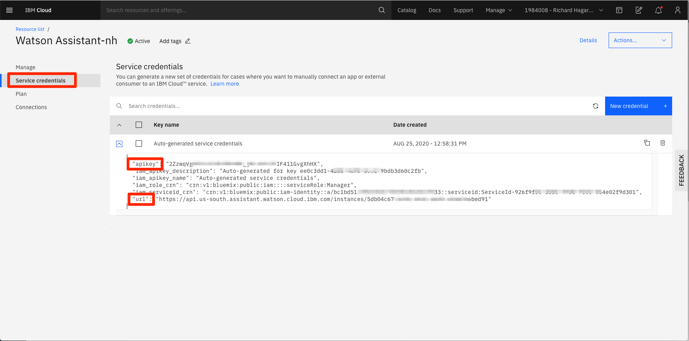
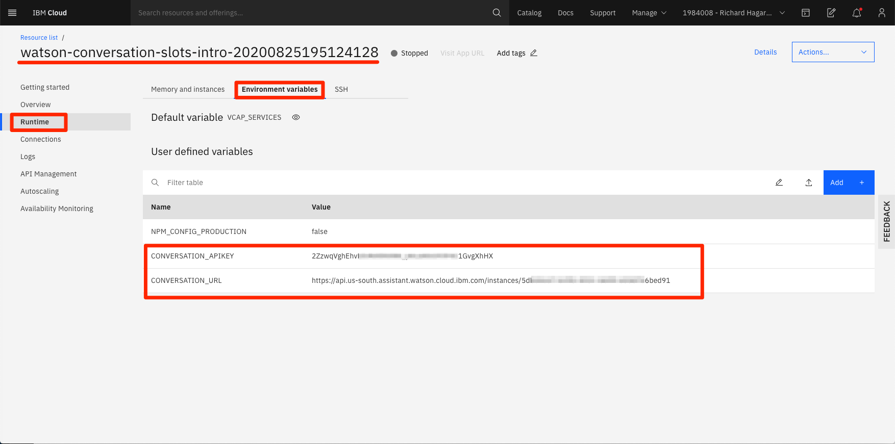

# Run on IBM Cloud with Cloud Foundry

This document shows how to run the `watson-assistant-slots-intro` application using Cloud Foundry on IBM Cloud.

## Steps

    

Click the ``Deploy to IBM Cloud`` button and hit ``Create`` on the next prompt. This will automatically create the services and application for you.

Note that the deployed application will not be able to run successfully until you specify the Assistant `APIKEY` and `URL` in the runtime evironment variables.

To find these values, return to the IBM Cloud resource page and locate the `Assistant` service resource that should have been created for you during the deploymnent. It will be listed in the `Services` section.

**NOTE**: If the Assistant service was not created, there may have been other issues during the deployment. If this occurs, try to re-deploy the app (hit the `Redeploy` button or start over).

Click on the Assistant resourse name to bring up the service panel. Click `Service credentials` to view the credentials. If no credentials exist, click `New credential +` to generate them.

Return to the IBM Cloud resource page and locate your provisioned app. It will be listed in the `Cloud Foundry apps` section. 

Click on the application to bring up the application panel. Select the `Runtime` menu option, and then the `Environment variables` tab. Add the credentials to the `User defined variables` table.

The key names must be following:
* CONVERSATION_APIKEY
* CONVERSATION_URL

After saving the variables, the application should automatically re-start. If it does not, click the `Actions` drop-down menu and select `Start`.

