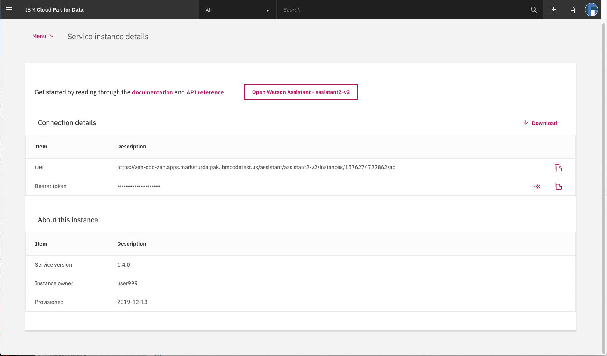

# Run locally

This document shows how to run the `watson-assistant-slots-intro` application on your local machine.

## Steps

1. [Clone the repo](#1-clone-the-repo)
2. [Create IBM Cloud services](#2-create-ibm-cloud-services)
3. [Configure Watson Assistant](#3-configure-watson-assistant)
4. [Get IBM Cloud credentials and add to .env](#4-get-ibm-cloud-services-credentials-and-add-to-env-file)
5. [Run the application](#5-run-the-application)

### 1. Clone the repo

Clone `watson-conversation-slots-intro` locally. In a terminal, run:

  `$ git clone https://github.com/ibm/watson-conversation-slots-intro`

We’ll be using the file [`data/watson-pizzeria.json`](../../data/watson-pizzeria.json) to upload
the Assistant Intents, Entities, and Dialog Nodes.

### 2. Create IBM Cloud services

Create the following service and name it `wcsi-conversation-service`:

* [**Watson Assistant**](https://cloud.ibm.com/catalog/services/conversation)

### 3. Configure Watson Assistant

#### Import the Assistant workspace.json:

The following instructions will depend on if you are provisioning Assistant from IBM Cloud or from an IBM Cloud Pak for Data cluster. Choose one:

<details><summary>Provision on IBM Cloud</summary>
<p>

* Find the Assistant service in your IBM Cloud Dashboard.
* Click on the `Manage` tab and then click on `Launch Watson Assistant`.
* Go to the `Skills` tab.
* Click `Create skill`
* Select the `Dialog skill` option and then click `Next`.
* Click the `Import skill` tab.
* Click `Choose JSON file`, go to your cloned repo dir, and `Open` the workspace.json file in [`data/watson-pizzeria.json`](../../data/watson-pizzeria.json).
* Select `Everything` and click `Import`.

</p>
</details>

<details><summary>Provision on IBM Cloud Pak for Data</summary>
<p>

* Find the Assistant service in your list of `Provisioned Instances` in your IBM Cloud Pak for Data Dashboard.
* Click on `View Details` from the options menu associated with your Assistant service.
* Click on `Open Watson Assistant`.
* Go to the `Skills` tab.
* Click `Create skill`
* Select the `Dialog skill` option and then click `Next`.
* Click the `Import skill` tab.
* Click `Choose JSON file`, go to your cloned repo dir, and `Open` the workspace.json file in [`data/watson-pizzeria.json`](../../data/watson-pizzeria.json).
* Select `Everything` and click `Import`.

</p>
</details>

To find the `WORKSPACE_ID` for Watson Assistant:

* Go back to the `Skills` tab.
* Find the card for the workspace you would like to use. Look for `WatsonPizzeria`.
* Click on the three dots in the upper right-hand corner of the card and select `View API Details`.
* Copy the `Workspace ID` GUID.


* In the next step, you will put this `Workspace ID` into the `.env file as ``WORKSPACE_ID``.

### 4. Get IBM Cloud services credentials and add to .env file

* Move the `watson-conversation-slots-intro/env.sample` file to ``watson-conversation-slots-intro/.env``.

* Put the `Workspace ID` into the `.env file as ``WORKSPACE_ID``.

```bash
WORKSPACE_ID=<put workspace id here>
```

The remaining credentials will depend on if you are provisioning Assistant from IBM Cloud or from an IBM Cloud Pak for Data cluster. Choose one:

<details><summary>Provision on IBM Cloud</summary>
<p>

* Use the `apikey` and `url` from your Watson Assistant service credentials in the `.env` file.


```bash
# If Assistant service is hosted on IBM Cloud, uncomment and use these variables for IAM Authentication
CONVERSATION_APIKEY=<put assistant IAM apikey here>
CONVERSATION_URL=<put assistant url here>
```

</p>
</details>

<details><summary>Provision on IBM Cloud Pak for Data</summary>
<p>

* Use the `URL` from your Watson Assistant service details to set the `CONVERSATION_URL` value in the `.env` file.



```bash
# If Assistant service is hosted on CP4D Cluster, uncomment and use these variables for CP4D Authentication
CONVERSATION_AUTH_TYPE=cp4d
CONVERSATION_AUTH_URL=<put cp4d url here>
CONVERSATION_AUTH_DISABLE_SSL=true
CONVERSATION_USERNAME=<put cp4d username here>
CONVERSATION_PASSWORD=<put cp4d password here>
CONVERSATION_URL=<put assistant url here>
CONVERSATION_DISABLE_SSL=true
```

`CONVERSATION_AUTH_URL`, `CONVERSATION_USERNAME` and `CONVERSATION_PASSWORD` are related to the URL and login credentials for accessing your IBM Cloud Pak for Data cluster.

</p>
</details>

### 5. Run the application

#### If you used the Deploy to IBM Cloud button...

If you used ``Deploy to IBM Cloud``, the setup is automatic.

#### If you decided to run the app locally...

```bash
npm install
npm start
```

The application will be available in your browser at http://localhost:3000

[](https://github.com/IBM/watson-assistant-slots-intro#deployment-options)
