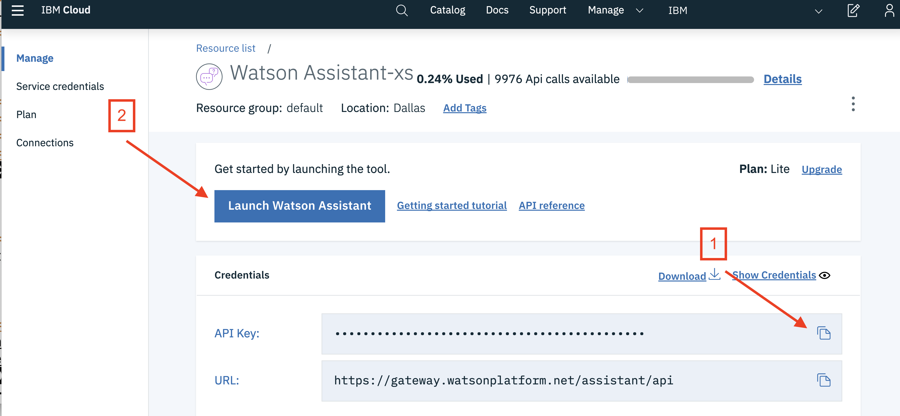
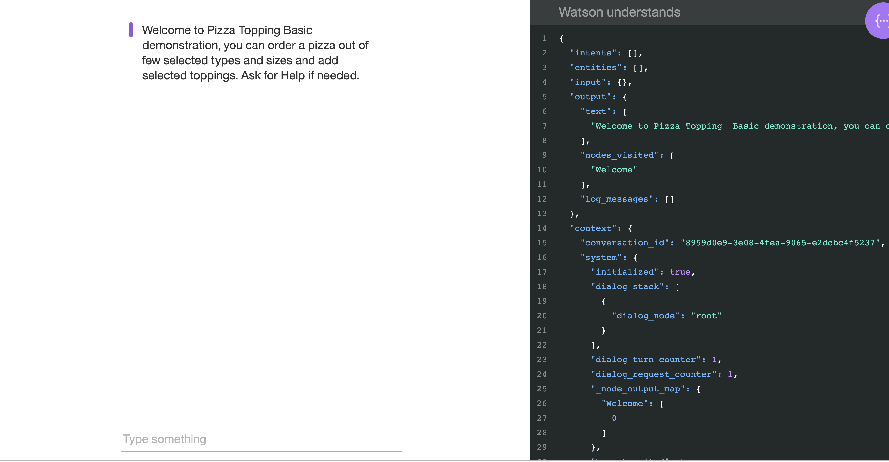

# Run on RedHat OpenShift

This document shows how to run the `watson-assistant-slots-intro` application in a container running on RedHat OpenShift.

## Prerequisites

You will need a running OpenShift cluster, or OKD cluster. You can provision [OpenShift on the IBM Cloud](https://cloud.ibm.com/kubernetes/catalog/openshiftcluster).

## Steps

* In your cluster, open your project or click on `+ Create Project` to create one.
* In the `Overview` tab, click on `Browse Catalog`

* Choose the `Node.js` app container and click `Next`.

* Give your app a name and add `https://github.com/IBM/watson-assistant-slots-intro` for the github repo, then click `Create`.

* You will need to export the key/value pairs from [env.sample](../../env.sample) as a config map. First, create an instance of [Watson Assistant](https://cloud.ibm.com/catalog/services/watson-assistant) and copy the `API key` [1] and then click `Launch Watson Assistant` [2].

* Go to the `Skills` tab.
* Click `Create skill`
* Click the `Import skill` tab.
* Click `Choose JSON file`, go to your cloned repo dir, and `Open` the workspace.json file in [`../../data/watson-pizzeria.json`](../../data/watson-pizzeria.json).
* Select `Everything` and click `Import`.

To find the `WORKSPACE_ID` for Watson Assistant:

* Go back to the `Skills` tab.
* Find the card for the workspace you would like to use. Look for `WatsonPizzeria`.
* Click on the three dots in the upper right-hand corner of the card and select `View API Details`.
* Copy the `Workspace ID` GUID.

* Back in the OpenShift or OKD UI, click on the `Resources` tab and choose `Config Maps` and then `Create Config Map`.

* Add a key for `WORKSPACE_ID` and the value you copied for the Workspace ID. Click `Add item` to continue.

* Add keys for `ASSISTANT_IAM_APIKEY` using the value you copied earlier, and for `PORT` with the value `8080`.

* Go to the `Applications` tab, choose `Deployments` and the `Environment` tab. Under `Environment From` `Config Map/Secret` choose the config map you just created [1]. Save the config [2]. The app will re-deploy automatically, or click `Deploy` to re-deploy manually [3]. To see the variables in the Config Map that will be exported in the app environment, click `View Details`.

* Under `Applications` -> `Routes` you will see your app. Click on the `Hostname` to see your Pizza ordering chat bot in action.

